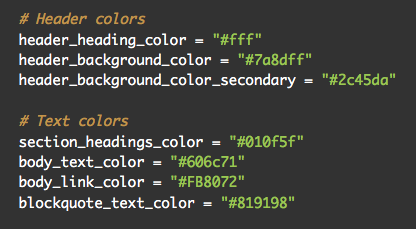
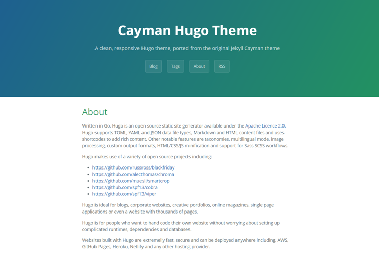
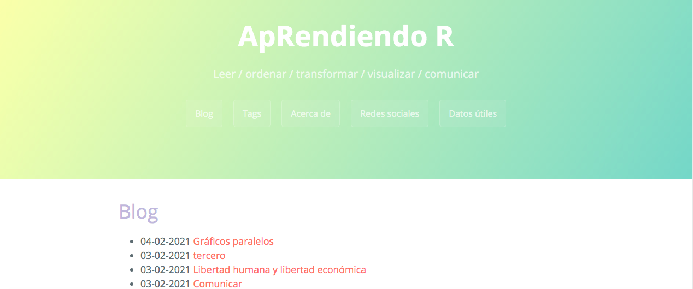

Este blog fue creado gracias a Hugo, Pandoc y Blogdown. Los pasos seguidos están muy  bien explicados [acá](https://bookdown.org/yihui/blogdown/), pero voy a dejar a continuación algunos detalles más específicos de la configuración.

### Argentinizarlo

Una de las primeras cosas que hice fue castellanizar algunas de las palabras visibles en el frontend que venían por default en inglés, como "about" por "acerca de". Para eso, modifiqué parámetros en el archivo config.toml:

```{r, echo=FALSE, out.width="100%"}

```

### Cambiar los colores

El theme elegido de [toda esta lista](https://themes.gohugo.io/) fue Cayman, pero también me metí a hacerle algunos cambios desde la configuración. Uno de ellos fue cambiar los colores, que eran así:

```{r, echo=FALSE, out.width="100%"}

```

Para tener a mano los códigos HEX, y ya organizados en paletas de colores, hice lo siguiente:

```{r, include=TRUE, collapse=TRUE}
library(RColorBrewer) #prendo librería
display.brewer.all() #le pido que me muestre los códigos HEX
brewer.pal(n = 4, name = "Set3") #le pido que me de los códigos de los primeros cuatro colores de la paleta Set 3
```

En el proceso se vivieron momentos estéticamente complicados, como este:

```{r, echo=FALSE, out.width="100%"}

```

Pero llegamos a un resultado un poco más sobrio. Los códigos usados son estos: 

```{r, echo=FALSE, out.width="100%"}

```


