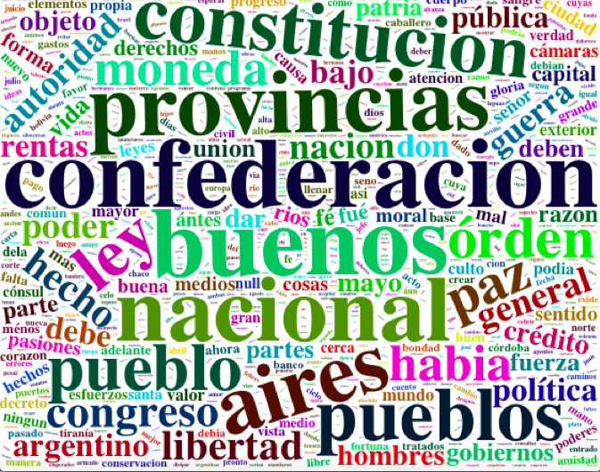
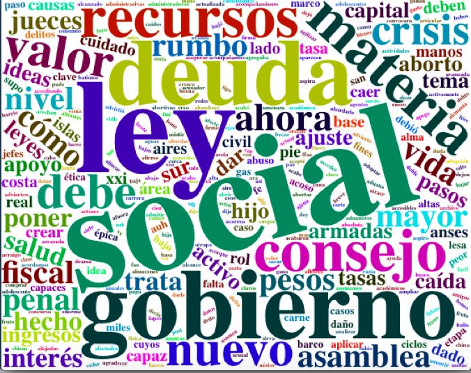

En este posteo, voy a intentar un análisis muy simple de las palabras más utilizadas en dos discursos de apertura de la asamblea legislativa muy particulares:

+ el más antiguo, pronunciado por Justo José de Urquiza en 1854 (en ese entonces, ante el llamado "Congreso Legislativo Federal")
+ el más reciente, pronunciado por Alberto Fernández en 2020

Para hacerlo, me voy a valer de los datos de la librería polAr, que ya cuenta con los discursos tokenizados.

### 1. Prendo librerías

```{r, include=TRUE, warning=FALSE, message=FALSE}

library(polAr) #para obtener los discursos tokenizados
library(tidyverse)
library(ggplot2)
library(patchwork) #para unir los dos gráficos de barras
library(wordcloud2) #para crear las nubes de palabras
library(webshot) #para que muestre nubes de palabras (spoiler: no funcionó)

```

### 2. Creo una nube de palabras con los términos más utilizados por Urquiza.

```{r, include=TRUE, warning=FALSE, message=FALSE}

show_available_speech()

urquiza <- get_speech(year = 1854)

frecuencia <- urquiza %>% 
  group_by(word) %>% 
  count() %>% 
  arrange(desc(n)) %>% 
  print()

nubeurquiza <- wordcloud2::wordcloud2(frecuencia)

print(nubeurquiza)

```
```{r, echo=FALSE, out.width="100%"}

```
### 3. Creo una nube de palabras con los términos más utilizados por Alberto Fernández.

```{r, include=TRUE}

alberto <- get_speech(year = 2020)

frecuencia2 <- alberto %>% 
  group_by(word) %>% 
  count() %>% 
  arrange(desc(n)) %>% 
  print()

nubealberto <- wordcloud2::wordcloud2(frecuencia2)

print(nubealberto)

```
```{r, echo=FALSE, out.width="100%"}

```

### Creo gráficos de barras con las palabras más utilizadas por cada uno.

```{r, include=TRUE, warning=FALSE, message=FALSE}

frecuencia3 <- alberto %>% 
  group_by(word) %>% 
  count() %>%
  arrange(desc(n)) %>% 
  ungroup() %>% 
  slice(1:5)

frecuencia4 <- urquiza %>% 
  group_by(word) %>% 
  count() %>%
  arrange(desc(n)) %>% 
  ungroup() %>% 
  slice(1:5)

barraslaberto <- ggplot(data = frecuencia3,
                        mapping = aes(x = word, y = n)) +
  geom_col() +
  ggthemes::theme_economist() +
  labs(title = "Palabras más usadas por Alberto Fernandez",
       subtitle = "Inicio de Asamblea Legislativa 2020",
       caption = "Fuente: Datos de polAr",
       y = "",
       x = "")

barrasurquiza <- ggplot(data = frecuencia4,
                        mapping = aes(x = word, y = n)) +
  geom_col() +
  ggthemes::theme_economist() +
  labs(title = "Palabras más usadas por Urquiza",
       subtitle = "Inicio de Asamblea Legislativa 1854",
       caption = "Fuente: Datos de polAr",
       y = "",
       x = "")

barrasurquiza + barraslaberto

```

Aunque el análisis realizado es muy básico, las nubes de palabras ya reflejan bastante de la época y circunstancias en las que los discursos fueron escritos. Mientras que el de Urquiza habla de un país -en ese momento, una confederación- en etapa de formación, el de Alberto habla claramente de una crisis social y económica.